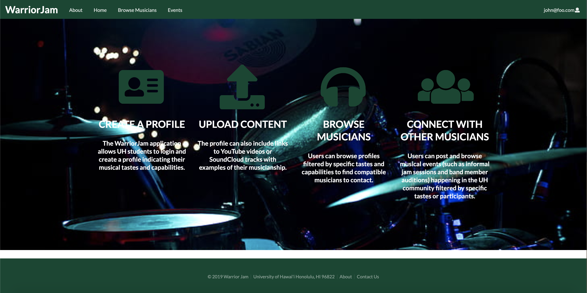
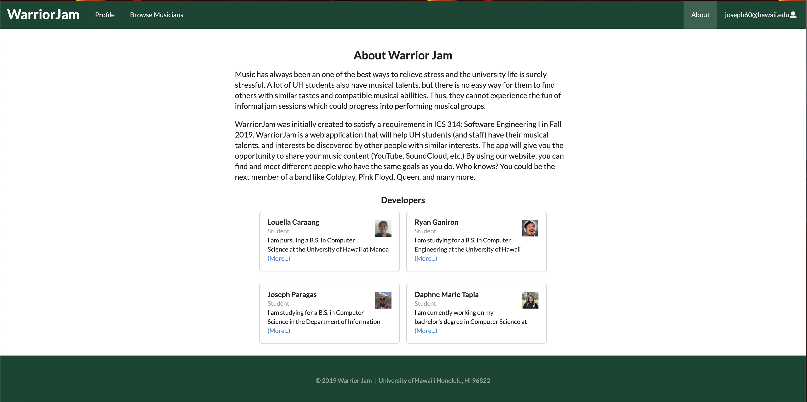
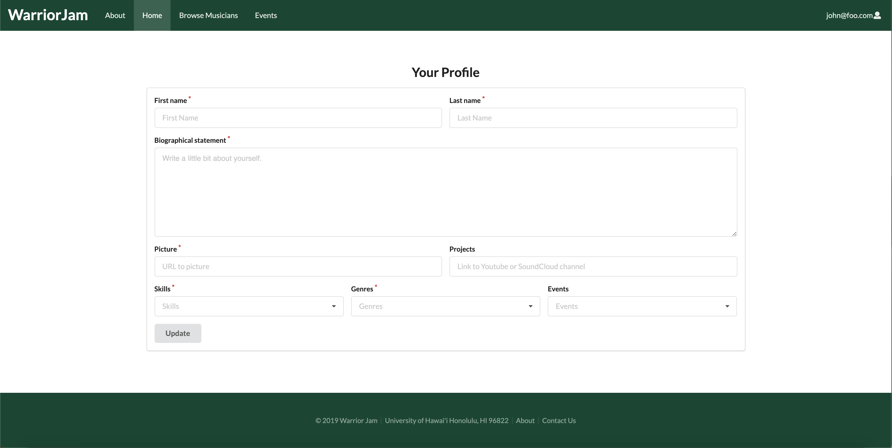
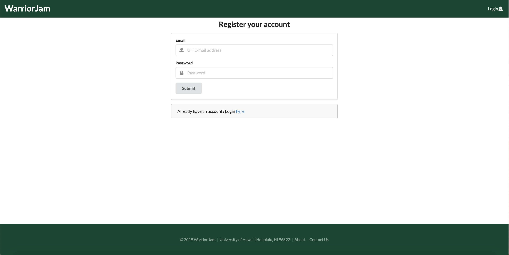
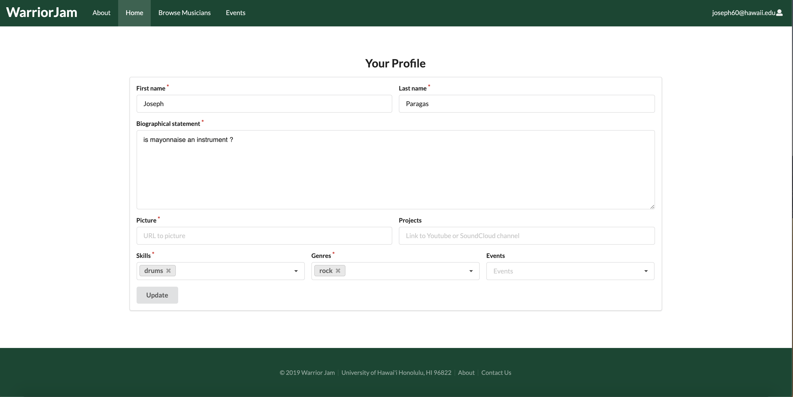
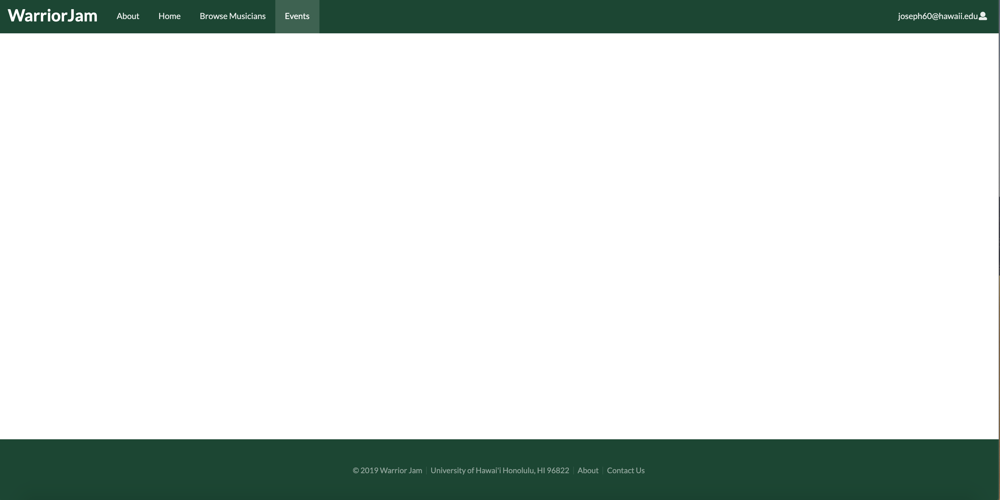
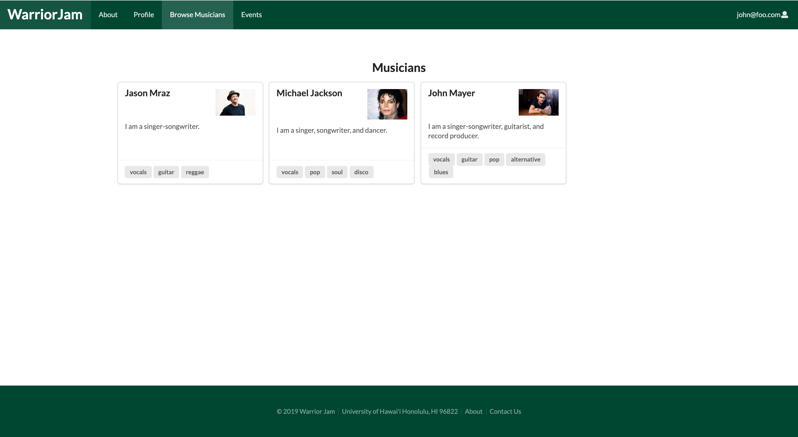

# Group Members 
- Joseph Paragas
- Louella Caraang 
- Ryan Ganiron 
- Daphne Tapia 

# About WarriorJam
WarriorJam is a web application that will help UH students (and staff) have their musical talents,
and interests be discovered by other people with similar interests. The app will give you
the opportunity to share your music content (YouTube, SoundCloud, etc.) By using our website, you can
find and meet different people who have the same goals as you do. Who knows? You could be the next
member of a band like Coldplay, Pink Floyd, Queen, and many more. 

[WarriorJam on Galaxy](http://warriorjam.meteorapp.com/#/)

# Developers Guide 
1. Go to the [Organization Page on GitHub](https://github.com/warrior-jam)
2. Clone the [WarriorJam App](https://github.com/warrior-jam/warrior-jam) repository
3. Change to the app directory and on the command line run ```$ meteor npm install ```to install dependencies 
4. To run website run ``` $ meteor npm run start``` 
5. The website should appear at (http://localhost:3000/)

# User Guide 
## Home Page 
The Home Page will welcome the user and provide an overview of the WarriorJam website. The user has the option to log in to an existing profile or create an account:  



# About Page
The About Page simply explains the objective of the WarriorJam application:



# Sign-In / Sign-Up Pages
Upon clicking the log in button, the user is prompted to enter their UH email and password credentials. The site is dedicated to the UH community and the user must provide a valid UH email when registering.





# Profile Page
The user will then be able to customize and update their profile. Components of the profile include: 
- Name
- Bio 
- Links to musical projects(Youtube, Soundcloud, etc.)
- Skills (guitar, vocals, etc.)
- Genres 
- Events they plan on attending



# Browse Musicians Page
The user will be able to browse the profiles of other musicians. Users can filter their search by a particular skill or genre:

.png)

# Events Page
The user will be able to browse musical events happening in the UH community. Users can filter their search by a specific genre or participants. The user is also able to post about an upcoming event such as informal jam sessions or band member auditions.



# Project Milestones

## Milestone 1: Landing & Mockup Pages
For Milestone 1, our goal was to lay the groundwork for the project. During this time we created mockup pages of our sign in/sign out pages and also created our Landing Page:


[Milestone 1 Project Board](https://github.com/warrior-jam/warrior-jam/projects/1)

## Milestone 2: Creating website pages
For Milestone 2, we were able to create the pages from our mockups in Milestone 1. We also were able to route the pages so that way you could navagate through the website:

Sign-In Page:


Musicians Page:



Events Page:


[Milestone 2 Project Board](https://github.com/warrior-jam/warrior-jam/projects/2)

## Milestone 3: Finished Product

[Milestone 3 Project Board](https://github.com/warrior-jam/warrior-jam/projects/3)
