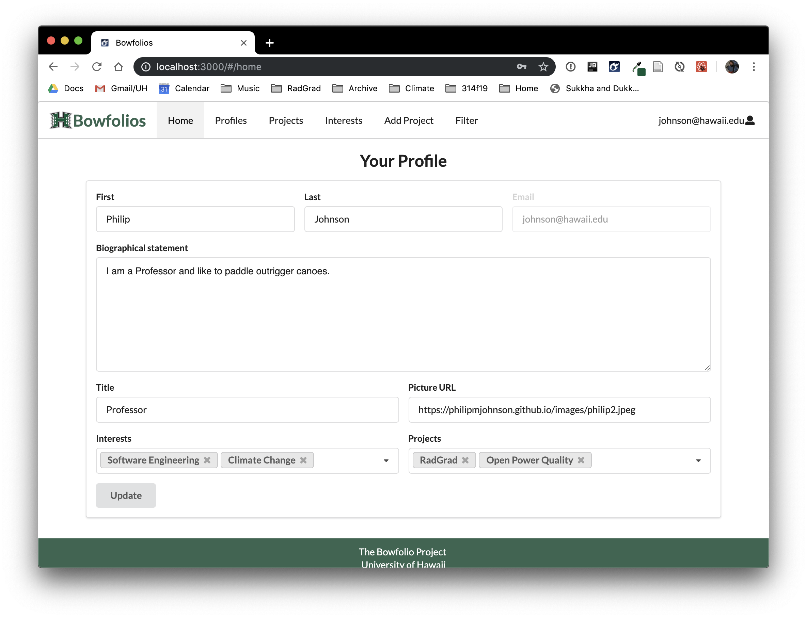

# Overview 
WarriorJam is a web application that will help UH students have their musical talents, and interests be discovered by other people with similar interests. The app will give the user the opportunity to share their music content (YouTube, Soundclout, etc.) WarriorJam can also be used to help a musician find a band that is suitable for them.  

# Goals of the Project
- Gain experience by working on a web application team
- Gain experience in website development 

# Goals of the App
- This app should provide a way for students to be discovered and to eventually help them achieve musical goals 
- Help starting musicians get their content out to the public

# Mockup Pages 
## Home Page 
The Home Page will welcome the user to the WarriorJam website and will give the option for the user to look for a band to join or look for band members:  

