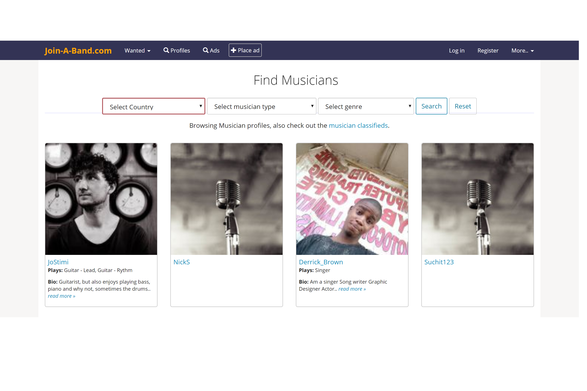

# Group Members 
- Joseph Paragas
- Louella Caraang 
- Ryan Ganiron 
- Daphne Tapia 

# Overview 
Problem: Many UH students have musical talents, but there is no easy way for them to find others with similar tastes and compatible musical abilities. Thus, they cannot experience the fun of informal jam sessions which could progress into performing musical groups.

Solution: WarriorJam is a web application that will help UH students have their musical talents, and interests be discovered by other people with similar interests. The app will give the user the opportunity to share their music content (YouTube, Soundclout, etc.) WarriorJam can also be used to help a musician find a band that is suitable for them.  

# Goals of the Project
- Gain experience by working on a web application team
- Gain experience in website development 

# Goals of the App
- This app should provide a way for students to be discovered and to eventually help them achieve musical goals 
- Help starting musicians get their content out to the public

# Mockup Pages 
## Home Page 
The Home Page will welcome the user to the WarriorJam website and will give the option for the user to look for a band to join or look for band members. Also the user has the option to log in to an existing profile or create an account:  

# Sign-In / Create Profile Page
The user will then be taken to a page where they must fill a form, where the user indicates their musical interests and goals. 

# Edit Profile Page
The user will then be able to customize their profile. Components of the profile include: 
- Name
- Bio 
- Links to music content (Youtube, Soundcloud, etc.)
- 

# Search Musician Page
The user will be able to search for musicians of their choosing.

