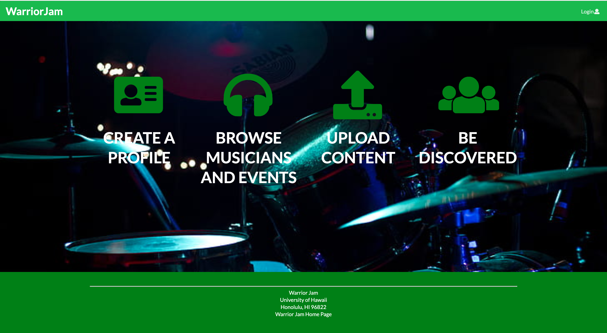

# Group Members 
- Joseph Paragas
- Louella Caraang 
- Ryan Ganiron 
- Daphne Tapia 

# Links
[Organization Page on GitHub](https://github.com/warrior-jam)

[Milestone 1 Project Board](https://github.com/warrior-jam/warrior-jam/projects/1)

[Milestone 2 Project Board](https://github.com/warrior-jam/warrior-jam/projects/2)

[WarriorJam on Galaxy](http://warriorjam.meteorapp.com/#/)

# Overview 
Music has always been an one of the best ways to relieve stress and the university life is surely
stressful. A lot of UH students also have musical talents, but there is no easy way for them to find
others with similar tastes and compatible musical abilities. Thus, they cannot experience the fun of 
informal jam sessions which could progress into performing musical groups. 

WarriorJam is a web application that will help UH students (and staff) have their musical talents,
and interests be discovered by other people with similar interests. The app will give you
the opportunity to share your music content (YouTube, SoundCloud, etc.) By using our website, you can
find and meet different people who have the same goals as you do. Who knows? You could be the next
member of a band like Coldplay, Pink Floyd, Queen, and many more. 

# User Guide 
## Home Page 
The Home Page will welcome the user and provide an overview of the WarriorJam website. The user has the option to log in to an existing profile or create an account:  

# Sign-In / Sign-Up Pages
Upon clicking the log in button, the user is prompted to enter their UH email and password credentials. The site is dedicated to the UH community and the user must provide a valid UH email when registering.

# Profile Page
The user will then be able to customize and update their profile. Components of the profile include: 
- Name
- Bio 
- Links to musical projects(Youtube, Soundcloud, etc.)
- Skills (guitar, vocals, etc.)
- Genres 
- Events they plan on attending

# Browse Musicians Page
The user will be able to browse the profiles of other musicians. Users can filter their search by a particular skill or genre:

# Browse Events Page
The user will be able to browse musical events happening in the UH community. Users can filter their search by a specific genre or participants:

# Add Event Page
The user is also able to post about an upcoming event such as informal jam sessions or band member auditions.

